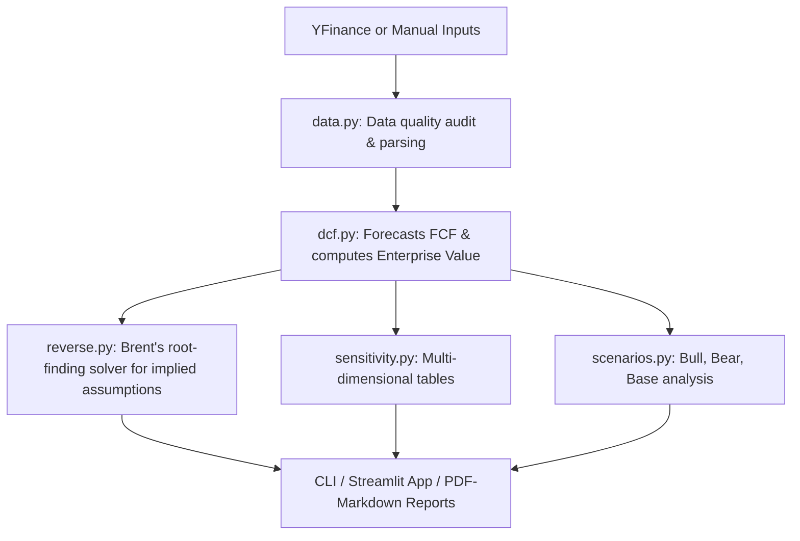

# Reverse DCF Project Recreation Guide

This guide provides a step-by-step, file-by-file roadmap for recreating the **Reverse DCF Valuation Model** project from scratch for educational purposes. It follows a bottom-up, dependency-first approach to software development, ensuring each component can be built, understood, and tested individually before building higher-level features.

---

## High-Level Architecture Flow

Before coding, it's vital to understand how data flows through this system:



---

## Phase 1: Project Setup & Package Infrastructure

In this phase, we establish the project folder layout and build-system configuration. This allows the package to be installed in editable mode (`pip install -e .`) so that imports work seamlessly across all subdirectories.

### 1. Requirements Configuration (`requirements.txt`)
* **Purpose:** Explicitly lists the third-party libraries required.
* **Dependencies:** None.
* **Key Contents:**
  * Numeric & Finance: `numpy`, `pandas`, `scipy`, `yfinance`
  * UI & CLI: `streamlit`, `typer`, `matplotlib`
  * Testing: `pytest`

### 2. Package Metadata Configuration (`pyproject.toml`)
* **Purpose:** Configures modern Python package metadata, specifies the setuptools backend, and configures test search paths for `pytest`.
* **Dependencies:** None.
* **Key Configuration:**
  ```toml
  [tool.setuptools.packages.find]
  where = ["src"]

  [tool.pytest.ini_options]
  testpaths = ["tests"]
  pythonpath = ["src", "."]
  ```

### 3. Package Entry Point (`__init__.py`)
* **Purpose:** Marks the `src/reversedcf` directory as a Python package and exposes key classes for convenient high-level imports.
* **Dependencies:** None.

---

## Phase 2: Core Valuation Engine

This phase implements the base mathematics of corporate finance and utility formatting. We build the data models using Python `@dataclass` and write the primary DCF calculations.

### 4. Utility Metrics Formatter (`metrics.py`)
* **Purpose:** Contains foundational helper functions to format currencies, percentages, and numeric values uniformly.
* **Dependencies:** Standard library only.
* **Educational Value:** Keeps UI files clean by separating presentation logic (formatting strings) from analytical calculations.

### 5. Valuation Core Engine (`dcf.py`)
* **Purpose:** The heart of the discounted cash flow. It models company inputs, calculates cash flow projections over a forecast period, and discounts them back to present value using WACC.
* **Dependencies:** `metrics.py`
* **Core Code Patterns:**
  * `DCFInputs`: A `@dataclass` representing current revenue, revenue CAGR, free cash flow margin, forecast years, WACC, terminal growth rate, net debt, and shares outstanding.
  * `DCFProjections`: A `@dataclass` holding the computed arrays of forecasted revenues, free cash flows, and discounted cash flows.
  * `DCFValuation`: A `@dataclass` representing the finalized Enterprise Value, Equity Value, and Implied Share Price.
  * `run_dcf(inputs: DCFInputs) -> DCFValuation`: Calculates forecast years + Terminal Value (Gordon Growth Model) discounted by WACC:
    $$\text{Terminal Value} = \frac{\text{FCF}_{\text{last}} \times (1 + g_{\text{terminal}})}{\text{WACC} - g_{\text{terminal}}}$$
    $$\text{PV} = \frac{\text{Cash Flow}}{(1 + \text{WACC})^t}$$

---

## Phase 3: Root-Solving & Numerical Analysis

Once we can compute a valuation from assumptions, we reverse the process. If we know the market price, what assumptions must have generated it?

### 6. Reverse Solvers (`reverse.py`)
* **Purpose:** Implements root-solving algorithms to reverse-engineer WACC, revenue growth rate, FCF margin, or terminal growth.
* **Dependencies:** `dcf.py`
* **Core Code Patterns:**
  * Uses `scipy.optimize.brentq` (Brent's Method) for rapid, stable numerical root finding.
  * Defines helper functions that compute $\text{Model EV} - \text{Market EV}$ for a given variable, then passes them to `brentq` to find where the difference equals zero.
  * Example: Finding required revenue CAGR $r$:
    ```python
    def objective(test_cagr):
        test_inputs = replace(inputs, revenue_cagr=test_cagr)
        return run_dcf(test_inputs).enterprise_value - target_ev
    
    solved_cagr = brentq(objective, -0.99, 2.0)
    ```

---

## Phase 4: Analytical Extensions (Scenarios & Sensitivity)

With core calculations and solvers complete, we build tools that analysts use to evaluate risk and explore different business futures.

### 7. Sensitivity Generator (`sensitivity.py`)
* **Purpose:** Generates 2D tables (matrices) showing how the implied share price reacts to combinations of WACC (y-axis) and Terminal Growth Rate (x-axis).
* **Dependencies:** `dcf.py`, `pandas`
* **Educational Value:** Shows students how sensitive DCF valuations are to minor changes in terminal assumptions (discount rate and perpetual growth).

### 8. Scenario Batcher (`scenarios.py`)
* **Purpose:** Sets up scenario configurations (Bear, Base, Bull, and Market-Implied) and runs valuation engines across all of them in a batch.
* **Dependencies:** `dcf.py`, `reverse.py`
* **Educational Value:** Teaches how to package models into structured portfolios/comparisons instead of single-point forecasts.

---

## Phase 5: Presentation & Visualization Core

We now create the engines that build visual outputs and structured text summaries.

### 9. Plotting Utilities (`plotting.py`)
* **Purpose:** Provides reusable plotting scripts using `matplotlib` to render clean, publication-ready financial charts.
* **Dependencies:** `matplotlib`, `scenarios.py`
* **Key Features:**
  * Renders revenue and FCF forecast curves.
  * Plots scenario comparison bar charts showing the range of implied stock prices relative to the current share price.

### 10. Financial Statement Comparer (`financials.py`)
* **Purpose:** Generates growth comparisons between historical actuals and model-implied targets.
* **Dependencies:** `pandas`
* **Key Features:**
  * Compares historical revenue growth vs. required growth.
  * Compares historical margins vs. required margins.

### 11. Markdown Report Writer (`report.py`)
* **Purpose:** Exporters that generate a beautiful, print-ready valuation report in Markdown.
* **Dependencies:** `dcf.py`, `scenarios.py`, `sensitivity.py`

---

## Phase 6: Live Data & Integrations

Now that the analytics pipeline is completely functional, we hook it up to real financial statements from the stock market.

### 12. Stock Statement Loader (`data.py`)
* **Purpose:** Interacts with the `yfinance` API to fetch real stock prices, balance sheet metrics (debt/cash), outstanding shares, and income statements. It also handles data caching and quality control audits.
* **Dependencies:** `yfinance`, `pandas`
* **Core Code Patterns:**
  * Implements `build_data_quality_statuses()` to identify if fetched metrics are complete, stale, or estimated.
  * Implements fallback parsing logic to extract balance sheet items (e.g. Total Debt, Cash and Equivalents) robustly.

---

## Phase 7: User Interfaces (CLI & Web Dashboard)

Finally, we wrap our clean analytical pipeline inside interfaces that allow users to interact with it seamlessly.

### 13. CommandLine Interface (`cli.py`)
* **Purpose:** A powerful command-line interface for terminal users.
* **Dependencies:** `typer`, `data.py`, `dcf.py`, `reverse.py`
* **Core Code Patterns:**
  * Uses `typer` decorator annotations to build arguments, commands, and options easily.

### 14. Streamlit Interactive Dashboard (`streamlit_app.py`)
* **Purpose:** A vibrant, responsive, modern web UI dashboard.
* **Dependencies:** `streamlit`, `reversedcf` packages
* **Key Layout Elements:**
  * **Sidebar:** Company lookup search box, editable text inputs/sliders for model assumptions.
  * **Main Canvas:** Metric blocks, data quality audits, interactive sensitivity tables, scenario bar charts, and a markdown report download button.

---

## Phase 8: Testing & Verification (Continuous Quality Control)

To ensure your model doesn't break during refactoring or additional updates, tests must be built alongside code development.

### 15. Unit Tests (`tests/` directory)
* **Purpose:** Contains unit tests verifying calculation engines, data parsers, and app builders.
* **Files to create:**
  * `test_dcf.py`: Verifies DCF formulas with hardcoded mock numbers.
  * `test_reverse_solver.py`: Verifies Brent solvers correctly return math properties.
  * `test_sensitivity.py`: Verifies matrix shapes and boundaries.
  * `test_app_import.py`: Verifies the web dashboard starts up and imports packages cleanly.

---

## Core Educational Takeaways for Students
1. **Mathematical Solvers vs. Guess-and-Check:** Understanding that root-solving packages (`scipy.optimize`) are much faster and more accurate than guessing variables manually in Excel.
2. **Data Cleanliness & Quality:** Showing that live web APIs (`yfinance`) are messy. The developer must write strong sanitizing guards and auditing filters.
3. **Decoupled Architecture:** Keeping financial mathematics (`dcf.py`, `reverse.py`) completely separate from presentation formats (`streamlit_app.py`, `plotting.py`). This allows running code via script, CLI, or web UI without changing core logic.
